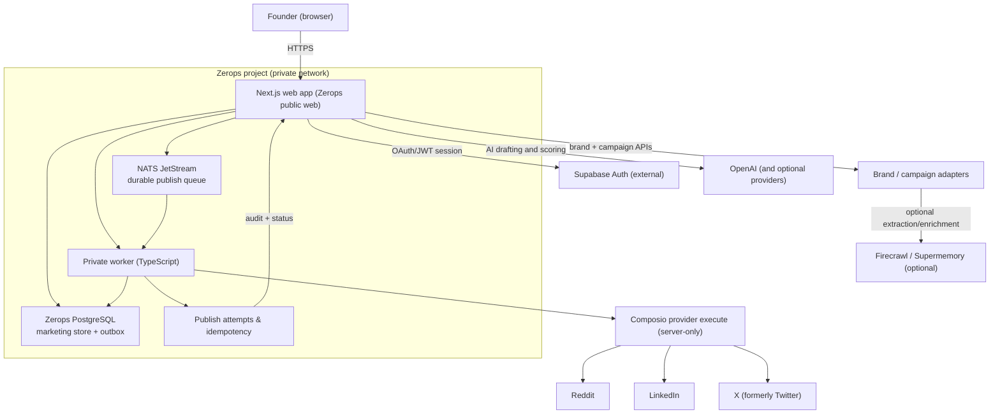

# VibeMarketer

## Cursor for marketing — an agent fleet for founder distribution

Give VibeMarketer a product URL and its agent fleet builds brand memory,
creates channel-native drafts, routes them through human approval, publishes
through connected providers, and reports what actually happened.

[Live application](https://web-2b24-3000.prg1.zerops.app) · [Source repository](https://github.com/Anand-0038/vibemarketer)

This repository contains the current VibeMarketer product: a multi-service SaaS
that turns a founder's product URL into evidence-backed marketing work, with
durable state, asynchronous execution, human approval, and honest provider
outcomes. The current hosted release runs on Zerops; deployment and challenge
evidence are documented separately from the product itself.

## Product flow

1. Paste a product URL.
2. Build attributable brand memory from live evidence.
3. Generate drafts for the selected channels.
4. Approve or reject drafts in the HITL queue.
5. Publish only after the provider confirms the action.
6. Review execution records and campaign reports.

Failed providers remain visibly unavailable. The product never substitutes fixtures, templates, or fake success for a failed live dependency.

## Latest live screenshots

The files below are taken from the running Zerops deployment and are intentionally
small enough for quick judge-friendly review.

| Capture | Link | Details |
| --- | --- | --- |
| <a href="https://web-2b24-3000.prg1.zerops.app/"></a> | [Open app](https://web-2b24-3000.prg1.zerops.app/) | Homepage / product entry points |
| <a href="https://web-2b24-3000.prg1.zerops.app/product"></a> | [Open product page](https://web-2b24-3000.prg1.zerops.app/product) | Public SEO-oriented product page |
| <a href="https://web-2b24-3000.prg1.zerops.app/login"></a> | [Open login](https://web-2b24-3000.prg1.zerops.app/login) | Authentication entry |

Latest demo evidence is also in:

- [`docs/demo/vibemarketer-core-demo.mp4`](docs/demo/vibemarketer-core-demo.mp4)
- [`docs/demo/vibemarketer-approval-boundary.mp4`](docs/demo/vibemarketer-approval-boundary.mp4)
- [`docs/demo/vibemarketer-judge-demo.mp4`](docs/demo/vibemarketer-judge-demo.mp4)

## Architecture

The application has one clear data boundary: Supabase remains the external
authentication provider, while Zerops PostgreSQL is the source of truth for
VibeMarketer marketing state, drafts, approvals, publishing attempts, and
reports.



### Why Supabase is still in the repository

Supabase is not the application database for the Zerops marketing path. It is
retained for Auth and a few existing compatibility/admin routes so the product
did not need a risky authentication rewrite during deployment. The active
Zerops path uses the authenticated Supabase user UUID as `owner_id`, then
writes tenant-scoped marketing data to Zerops PostgreSQL. This keeps identity
and application persistence separate and makes the web and worker share one
durable source of truth.

## Stack

| Path | Purpose |
| --- | --- |
| `apps/web` | Next.js 16 application and API routes |
| `packages/engine` | Agent, connector, memory, research, and scoring logic |
| `supabase` | External Auth and the compatibility schema/migrations |
| `specs` | Acceptance criteria for product behavior |
| `zerops.yaml` | Web and private publishing-worker build/run definitions |
| `zerops-*-import.yaml` | Reviewable PostgreSQL, NATS, and worker service manifests |

Supabase Auth remains external for the challenge slice. On Zerops,
tenant-scoped marketing state and publishing state use managed PostgreSQL;
NATS JetStream wakes a private worker that drains the durable outbox. Provider
credentials and server-only keys never enter the browser or repository.

## Local development

Requires Node.js 20+ and pnpm.

```bash
corepack enable
corepack pnpm install
cp .env.example .env
cp .env.example apps/web/.env
corepack pnpm dev
```

Fill only the provider credentials needed for the flow you are testing. Keep `AUTH_BYPASS`, `ALLOW_OPEN_APP`, `ALLOW_SHARED_WORKSPACE`, and `DODO_WEBHOOK_ALLOW_UNSIGNED` disabled outside isolated local development.

## Verification

```bash
corepack pnpm test:unit
corepack pnpm lint
corepack pnpm build
```

Use `corepack pnpm test:engine` for the engine suite and `corepack pnpm test:content` for web content and pure-logic tests.

The judge-verifiable product contract is documented in
[`specs/marketing-loop.md`](specs/marketing-loop.md). The challenge release
requirements and remaining human-controlled gates are tracked in
[`docs/CHALLENGE-EVIDENCE-MAP.md`](docs/CHALLENGE-EVIDENCE-MAP.md).

## Live deployment

The hosted release runs the product stack on Zerops in small, verified
phases. Zerops is responsible for the application runtime, managed database,
durable queue, private worker network, health checks, and deployment surface.

- Current Zerops project: `0xanand` with managed `db` PostgreSQL, `nats`,
  `web`, and private `worker` services provisioned.
- Root `zerops.yaml` builds the Next.js web service and the TypeScript
  publishing worker. The web runtime selects Zerops PostgreSQL for marketing
  persistence, while Supabase remains the Auth boundary.
- NATS is a durable wake-up transport; the PostgreSQL outbox remains the
  source of truth for idempotency, leases, retries, and provider outcomes.
- The staged architecture and verification evidence are documented in
  [`docs/ZEROPS-HACK-PLAN.md`](docs/ZEROPS-HACK-PLAN.md).
- The redacted live smoke evidence is recorded in
  [`docs/LIVE-DEMO-EVIDENCE.md`](docs/LIVE-DEMO-EVIDENCE.md).
- The short judge walkthrough is scripted in
  [`docs/DEMO-SCRIPT.md`](docs/DEMO-SCRIPT.md).
- A real 39-second core-flow recording is available at
  [`docs/demo/vibemarketer-core-demo.mp4`](docs/demo/vibemarketer-core-demo.mp4).
- The approval-boundary recording shows durable queue intent and the honest
  no-provider outcome at [`docs/demo/vibemarketer-approval-boundary.mp4`](docs/demo/vibemarketer-approval-boundary.mp4).
- The combined 86-second judge walkthrough is available at
  [`docs/demo/vibemarketer-judge-demo.mp4`](docs/demo/vibemarketer-judge-demo.mp4).
- The exact provider requirements and verification order are documented in
  [`docs/PROVIDER-SETUP.md`](docs/PROVIDER-SETUP.md).
- Live Zerops web deployment: [`web-2b24-3000.prg1.zerops.app`](https://web-2b24-3000.prg1.zerops.app)
- Verified from outside the build environment: `/`, `/login`, and `/signup`
  return `200`, `/app` redirects unauthenticated visitors to `/login`, static
  assets return `200`, `/api/auth/email` accepts the unauthenticated same-origin
  form POST, and `/api/ready` returns `{ "ok": true }`.
- The web runtime, managed PostgreSQL, NATS, and private worker services are
  active. The worker log shows a real NATS connection and successful private
  drain checks after the shared internal secret was activated.
- The core brand → campaign → draft path can use direct public HTTP extraction,
  OpenAI, and Zerops PostgreSQL when Firecrawl/Supermemory enrichment keys are
  absent. Composio and a connected social account are still required before a
  provider-confirmed publication is claimed.

### Judge smoke

1. Open [`/signup`](https://web-2b24-3000.prg1.zerops.app/signup).
2. Use a disposable email address and a password with at least eight
   characters, including a letter and a number.
3. Select **Create account**. New accounts are autoconfirmed in this
   challenge deployment, so no OTP or inbox step is required; the app opens at
   `/app`. The email form posts to `/api/auth/email` and redirects to the
   configured public host.
4. Sign out and sign back in once to verify the complete Auth session path.
5. Submit a public product URL, then follow the brand-memory, campaign, draft,
   and HITL queue flow. Missing provider credentials remain visibly
   unavailable instead of becoming fake success.

Readiness can be checked without an account at
[`/api/ready`](https://web-2b24-3000.prg1.zerops.app/api/ready), which should
return HTTP `200` with `"status":"ready"`. The response also reports the
non-secret Auth checks (`configured`, `reachable`, `signupEnabled`, and
`confirmationRequired`) so a judge can distinguish an Auth/OTP configuration
problem from a database or deployment problem.

## Pricing

- Starter — ₹1,499
- Growth — ₹3,999
- Pro — ₹7,999

## License

Proprietary.
