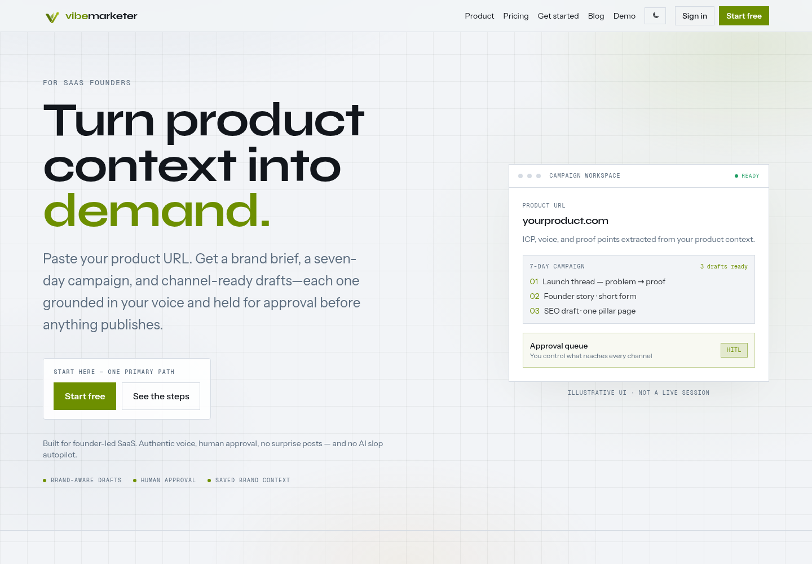
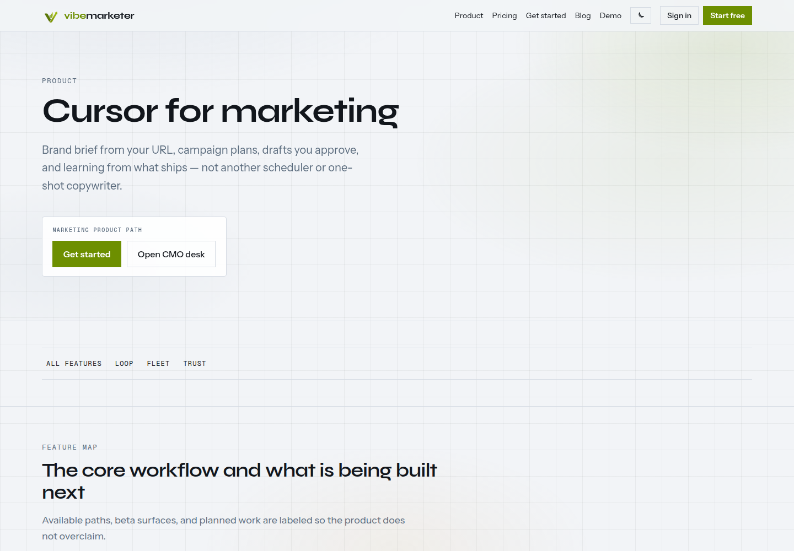
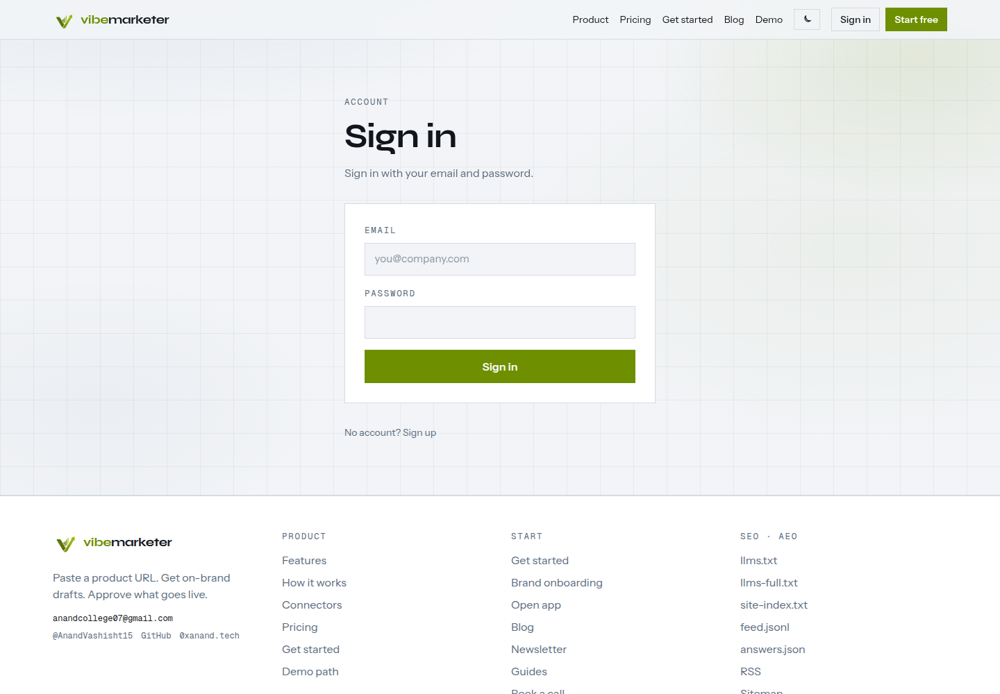
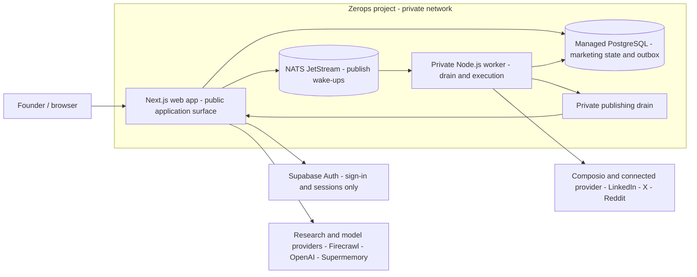

# VibeMarketer

## Cursor for marketing

Give VibeMarketer a product URL and its agent fleet builds brand memory,
creates channel-native drafts, routes them through human approval, publishes
through connected providers, and reports what actually happened.

[Product website](https://www.vibemarketer.fun) · [Live application](https://web-2b24-3000.prg1.zerops.app) · [Source repository](https://github.com/Anand-0038/vibemarketer)

This is the active VibeMarketer codebase and hosted application, not a
separate hackathon-only demo. It began as an experimental prototype and is
being hardened into a durable multi-service SaaS: the product workflow stays
the same while persistence, asynchronous publishing, private networking, and
deployment verification have been made production-oriented.

## Product flow

1. Paste a product URL.
2. Build attributable brand memory from live evidence.
3. Generate drafts for the selected channels.
4. Approve or reject drafts in the HITL queue.
5. Publish only after the provider confirms the action.
6. Review execution records and campaign reports.

Failed providers remain visibly unavailable. The product never substitutes fixtures, templates, or fake success for a failed live dependency.

VC Brain (`/vc-brain`, `/app/radar`) is a secondary workflow built on the same evidence, memory, and agent engine.

## Product in the browser

<p>
  <a href="https://web-2b24-3000.prg1.zerops.app/">
    
  </a>
  <a href="https://web-2b24-3000.prg1.zerops.app/product">
    
  </a>
  <a href="https://web-2b24-3000.prg1.zerops.app/login">
    
  </a>
</p>

The captures above are from the live public application. The dashboard panel
shown on the homepage is explicitly labelled as illustrative UI; it is not
presented as a fabricated customer session.

## Architecture

The application has one clear data boundary: Supabase remains the external
authentication provider, while Zerops PostgreSQL is the source of truth for
VibeMarketer marketing state, drafts, approvals, publishing attempts, and
reports.



### Why Supabase is still in the repository

Supabase is not the application database for the Zerops marketing path. It is
retained for Auth and a few existing compatibility/admin routes so the product
did not need a risky authentication rewrite during deployment. The active
Zerops path uses the authenticated Supabase user UUID as `owner_id`, then
writes tenant-scoped marketing data to Zerops PostgreSQL. This keeps identity
and application persistence separate and makes the web and worker share one
durable source of truth.

## Stack

| Path | Purpose |
| --- | --- |
| `apps/web` | Next.js 16 application and API routes |
| `packages/engine` | Agent, connector, memory, research, and scoring logic |
| `supabase` | External Auth and the compatibility schema/migrations |
| `specs` | Acceptance criteria for product behavior |
| `zerops.yaml` | Web and private publishing-worker build/run definitions |
| `zerops-*-import.yaml` | Reviewable PostgreSQL, NATS, and worker service manifests |

Supabase Auth remains external for the challenge slice. On Zerops,
tenant-scoped marketing state and publishing state use managed PostgreSQL;
NATS JetStream wakes a private worker that drains the durable outbox. Provider
credentials and server-only keys never enter the browser or repository.

## Local development

Requires Node.js 20+ and pnpm.

```bash
corepack enable
corepack pnpm install
cp .env.example .env
cp .env.example apps/web/.env
corepack pnpm dev
```

Fill only the provider credentials needed for the flow you are testing. Keep `AUTH_BYPASS`, `ALLOW_OPEN_APP`, `ALLOW_SHARED_WORKSPACE`, and `DODO_WEBHOOK_ALLOW_UNSIGNED` disabled outside isolated local development.

## Verification

```bash
corepack pnpm test:unit
corepack pnpm lint
corepack pnpm build
```

Use `corepack pnpm test:engine` for the engine suite and `corepack pnpm test:content` for web content and pure-logic tests.

## Live deployment

The hosted release runs the product stack on Zerops in small, verified
phases. Zerops is responsible for the application runtime, managed database,
durable queue, private worker network, health checks, and deployment surface.

- Current Zerops project: `0xanand` with managed `db` PostgreSQL, `nats`,
  `web`, and private `worker` services provisioned.
- Root `zerops.yaml` builds the Next.js web service and the TypeScript
  publishing worker. The web runtime selects Zerops PostgreSQL for marketing
  persistence, while Supabase remains the Auth boundary.
- NATS is a durable wake-up transport; the PostgreSQL outbox remains the
  source of truth for idempotency, leases, retries, and provider outcomes.
- The staged architecture and verification evidence are documented in
  [`docs/ZEROPS-HACK-PLAN.md`](docs/ZEROPS-HACK-PLAN.md).
- The exact provider requirements and verification order are documented in
  [`docs/PROVIDER-SETUP.md`](docs/PROVIDER-SETUP.md).
- Live Zerops web deployment: [`web-2b24-3000.prg1.zerops.app`](https://web-2b24-3000.prg1.zerops.app)
- Verified from outside the build environment: `/` and `/login` return `200`,
  `/app` redirects unauthenticated visitors to `/login`, static assets return
  `200`, and `/api/ready` returns `{ "ok": true }`.
- The web runtime, managed PostgreSQL, NATS, and private worker services are
  active. The worker log shows a real NATS connection and successful private
  drain checks after the shared internal secret was activated.
- Real research/publishing provider secrets are not configured yet, so no
  provider-confirmed campaign result is claimed.

## Challenge provenance

The WeMakeDevs Zerops Challenge is the context in which this existing product
is being hardened and submitted. The challenge work is the infrastructure and
reliability transformation around VibeMarketer, not a replacement product or
a claim that the original prototype was created during the event.

## Pricing

- Starter — ₹1,499
- Growth — ₹3,999
- Pro — ₹7,999

## License

Proprietary.
